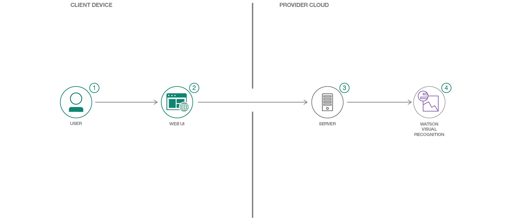
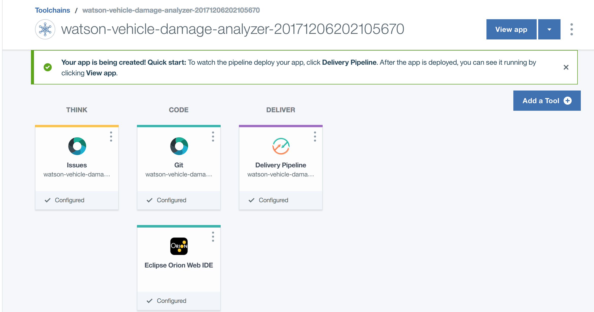
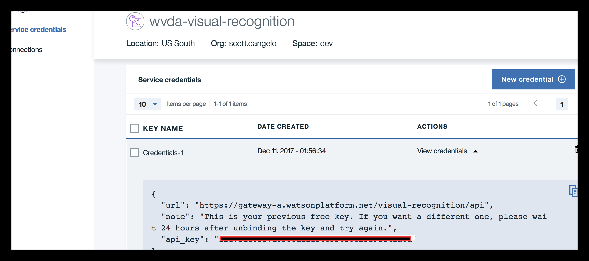

**Work In Progress**
# This Pattern in incomplete. Please Check back soon for the finished version

[](https://travis-ci.org/IBM/cities-from-space)

# cities-from-space

When the reader has completed this Code Pattern, they will understand how to:

* Utilize images from the International Space Station to train a Visual Recognition custom classifier.
* Create a Node.js server that can utilize the Watson Visual Recognition service for classifying images.
* Have a server initialize a Visual Recognition custom classifier at startup.
* Demonstrate how to classify images of cities from space using Watson Visual Recognition.



## Flow

1. User interacts with the web UI and chooses an image of a city at night, as viewed from space.
2. The image is passed to the server application running in the cloud.
3. The server sends the image to Watson Visual Recognition Service for analysis.
4. Visual Recognition service classifies the image and returns the information to the server, indicating the confidence level that the image is of a particular city.

## Included components

* [Watson Visual Recognition](https://www.ibm.com/watson/developercloud/visual-recognition.html): Visual Recognition understands the contents of images - tag images, find human faces, approximate age and gender, and find similar images in a collection.

## Featured Technologies

* [Node.js](https://nodejs.org/): An asynchronous event driven JavaScript runtime, designed to build scalable applications.

# Watch the Video


# Steps

This code pattern contains several pieces. The app server communicates with the Watson Visual Recognition service. The web application is built locally and run in a browser, or accessible on the web server at the same URL. You can deploy the server application using the IBM Cloud, or locally on your machine.

## Deploy the server application to IBM Cloud

[](https://bluemix.net/deploy?repository=https://github.com/IBM/cities-from-space)

Press the above ``Deploy to IBM Cloud`` button and then click on ``Deploy``.

To monitor the deployment, in Toolchains click on `Delivery Pipeline`  and view the logs while the apps is being deployed.



To see the app and services created and configured for this code pattern, use the IBM Cloud dashboard. The app is named `cities-from-space` with a unique suffix. The following services are created and easily identified by the `cfs-` prefix:
    * cfs-visual-recognition

Once deployed, jump to [step #5](#5-use-the-application-from-a-browser) to test.

## Deploy the server application locally

Perform steps 1-4:

1. [Clone the repo](#1-clone-the-repo)
2. [Create the Watson Visual Recognition service](#2-create-the-watson-visual-recognition-service)
3. [Add Visual Recoginition API key to .env file](#3-add-visual-recoginition-api-key-to-env-file)
4. [Install dependencies and run server](#4-install-dependencies-and-run-server)

## 1. Clone the repo

Clone the `cities-from-space` repo locally. In a terminal, run:

```
$ git clone https://github.com/IBM/cities-from-space.git
$ cd cities-from-space
```

## 2. Create the Watson Visual Recognition service

Create a Watson Visual Recognition service using IBM Cloud or Watson Studio, a free `Lite` plan and a `Standard` plan is available for both. Ensure the service is named `wvda-visual-recognition`.

* [**Watson Visual Recognition on Watson Studio**](https://dataplatform.ibm.com/data/discovery/watson_vision_combined/details?target=watson&context=analytics)

OR

* [**Watson Visual Recognition on IBM Cloud**](https://console.bluemix.net/catalog/services/visual-recognition)

### Why the two choices?

Traditionally [IBM Cloud](https://console.bluemix.net) was the main platform for application developers, while [IBM Watson Studio](https://dataplatform.ibm.com/) (formally Data Science Experience) was targetted towards Data Scientists. In early 2018, a new offering, [Watson Studio was introduced](https://medium.com/ibm-watson/introducing-ibm-watson-studio-e93638f0bb47). Watson Studio provides a suite of tools for data scientists and application developers, allowing them to collaboratively connect to data, wrangle that data and use it to build, train and deploy models at scale.

To help you decide which platform to use, try answering the following questions:

* Am I using multiple data sets? Use Watson Studio
* Am I creating a custom classifier for Watson Visual Recognition? Use Watson Studio
* Am I using a built-in classifier of Watson Visual Recognition? Use IBM Cloud

Sufficiently confused? Don't worry. Any resource that you create in IBM Cloud or Watson Studio will be available in the other.

## 3. Add Visual Recoginition API key to .env file

To use the Visual Recognition service you will need the API key.

To retrieve the key in Watson Studio go to the following tab:


In IBM Cloud it will look like this:



Rename the ``cities-from-space/server/env.example`` file to ``cities-from-space/server/.env`` and add the API key:

```
# Watson Visual Recognition
VISUAL_RECOGNITION_API_KEY=<add_api_key>
```

## 4. Install dependencies and run server

#### If you used the Deploy to IBM Cloud button...

If you used ``Deploy to IBM Cloud``, the setup is automatic.

#### If you decided to run the app locally...

* Install [Node.js and npm](https://nodejs.org/en/download/) (`npm` version 4.5.0 or higher)

* Install the app dependencies and start the app:

```
$ npm install
$ npm start
```

## 5. Use the application from a browser

In order to classifier images of cities from space, you can point a browser to the server and test the application.

* For a server running locally, open a browser tab to `localhost:<port>`.
* For a server running on IBM Cloud, open a browser tab and point it to the URL for your server `<IBM_Cloud_server_URL:port>`

The default port is `3000`

You can then upload a local picture, i.e one from this repository in `test/data/`

# Troubleshooting

* Test the Visual Recognition service using the instructions in [test/README.md](test/README.md)

* Error: Server error, status code: 502, error code: 10001, message: Service broker error: {"description"=>"Only one free key is allowed per organization. Contact your organization owner to obtain the key."}

> Only one free key is allowed per organization. Binding the service to an application triggers a process that tries to allocate a new key, which will get rejected. If you already have an instance of Visual Recognition and an associated key, you can bind that instance to your application or update the API key in your server code to tell the app which key to use.

* Deploy or Dashboard shows app is not running

> You may see logs in the Deploy Stage that indicate that the app has crashed and cannot start:
```
Starting app cities-from-space-20171206202105670 in org scott.dangelo / space dev as scott.dangelo@ibm.com...

0 of 1 instances running, 1 starting
0 of 1 instances running, 1 starting
0 of 1 instances running, 1 starting
0 of 1 instances running, 1 starting
0 of 1 instances running, 1 starting
0 of 1 instances running, 1 starting
0 of 1 instances running, 1 starting
0 of 1 instances running, 1 starting
0 of 1 instances running, 1 crashed
FAILED
Error restarting application: Start unsuccessful

TIP: use 'cf logs cities-from-space-20171206202105670 --recent' for more information

Finished: FAILED
```

> OR you may see in the IBM Cloud console that the app is `Not Running`:


> Both of these can be spurious errors. Click the `Visit App URL` link in the IBM Cloud console, or try `Runtime` -> `SSH`, or simply test the app to see if it is running.

# Links
* [Watson Node.js SDK](https://github.com/watson-developer-cloud/node-sdk)

# Learn more

* **Artificial Intelligence Code Patterns**: Enjoyed this Code Pattern? Check out our other [AI Code Patterns](https://developer.ibm.com/code/technologies/artificial-intelligence/).
* **AI and Data Code Pattern Playlist**: Bookmark our [playlist](https://www.youtube.com/playlist?list=PLzUbsvIyrNfknNewObx5N7uGZ5FKH0Fde) with all of our Code Pattern videos
* **With Watson**: Want to take your Watson app to the next level? Looking to utilize Watson Brand assets? [Join the With Watson program](https://www.ibm.com/watson/with-watson/) to leverage exclusive brand, marketing, and tech resources to amplify and accelerate your Watson embedded commercial solution.

# License

[Apache 2.0](LICENSE)
